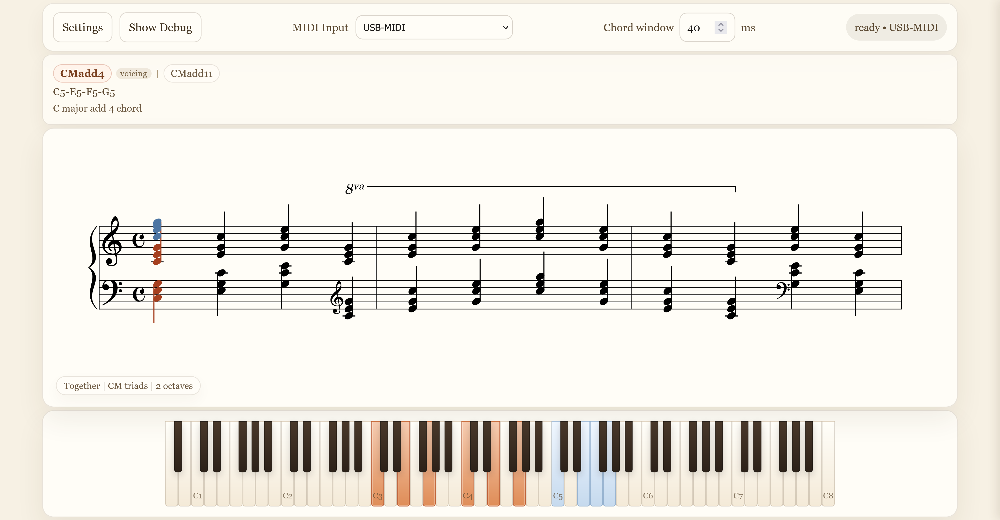

# Grand Staff Trainer
Grand Staff Trainer is a customisable piano practice tool for learning how notes, scales, chords, arpeggios and cadences are read and played on the grand staff. It provides live MIDI input with readable notation and visual feedback to help connect the player's input with real sheet music. There are three primary features and each can be toggled in accordance with the player's preference.

Primary features:
1. [Input naming panel](input-naming-panel)
2. [Exercise panel](exercise-panel)
3. [Keyboard display panel](keyboard-display-panel)

## Input Naming Panel

## Exercise Panel

## Keyboard Display Panel
