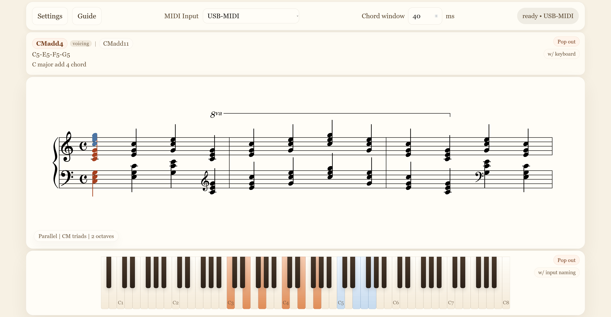
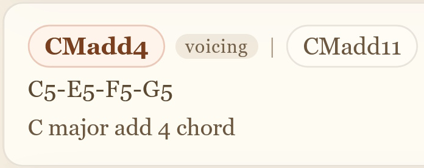
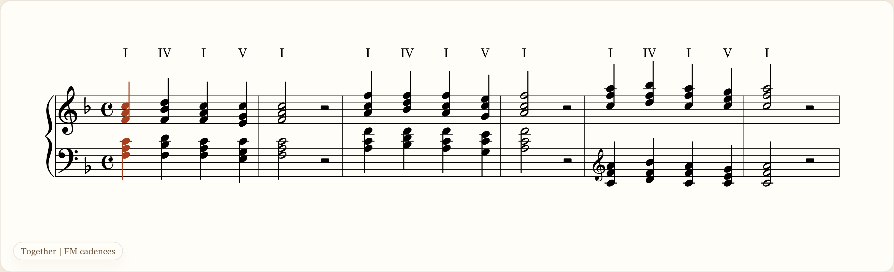
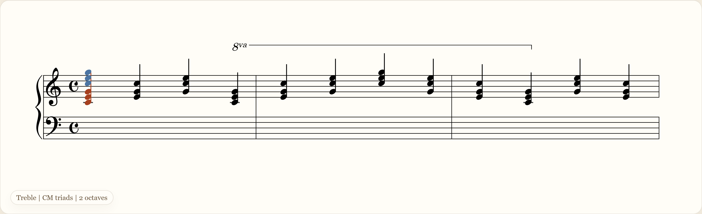
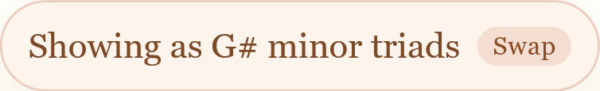
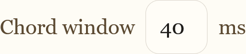
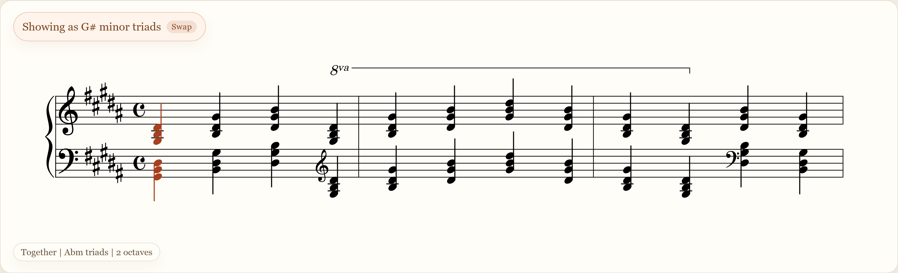

# Grand Staff Trainer
Grand Staff Trainer is a customisable piano practice tool for learning how notes, scales, chords, arpeggios and cadences are read and played from the grand staff in all keys. It provides live MIDI input analysis with readable notation and visual feedback to help connect the player's input with practical sheet music. There are three primary features and each can be toggled in accordance with the player's preferences. The settings button opens the menu that contains all configuration settings.

Primary feature explanations:
1. [Input naming panel](#input-naming-panel)
2. [Exercise panel](#exercise-panel) ([chord window](#chord-window) is related to the exercise panel)
3. [Keyboard display panel](#keyboard-display-panel)

Design philosophy rationale:
1. [Input naming panel](#input-analysis)
2. [Exercise panel](#exercise-engraving)

## Input Naming Panel
The input naming panel is the topmost panel when visible. It analyses the player's current input using a key-agnostic naming system centred around C and provides information on its musical structure. It is compatible with sustain pedal use. Significant effort was put into making the analysis as transparent about ambiguities as possible, refer to [here](#input-analysis) for the design philosophy.

Every analysis consists of three lines:

1. A shorthand line that displays a best-effort primary reading and any reasonable alternatives/ambiguities.
2. A line that displays the exact notes.
3. A longhand line that displays a full name.

The input naming panel is capable of analysing the following structures. Please note this list is to show some shorthand examples using C and is by no means exhaustive.

- Individual notes (C, Db/C#)
- Intervals (longhand names include semitone distance)
    - First octave: Cm2, CM2, Cm3, CM3, CP4, CTT, CP5, Cm6, CM6, Cm7, CM7, CP8
    - Second octave: Cm9, CM9, Cm10, CM10, CP11, CTT, CP12, Cm13, CM13, Cm14, CM14, CP15
    - Third octave and beyond: revert to simple/first octave naming
- Triads and other three note structures
    - Triad qualities: CM, Cm, Cdim, Caug
    - Suspended: Csus2, Csus4
    - Inversions: CM/E, Csus2/D
    - 5 chords: C5
- 7th chords and other four note structures
    - 7th qualities: CM7, C7, Cm7, Cm7b5, Cdim7, CmM7, CaugM7, Caug7
    - 6th chords: C6, Cm6
    - All inversions: Cdim7/Eb
    - Added notes: CMadd2, CMadd4, CMadd9, CMadd11
- Repeated chord tones are recognised and considered (e.g. sustain pedal use)

## Exercise Panel
The exercise panel is the centre panel when visible. It is the main feature of Grand Staff Trainer and therefore assigned the most space. It renders sheet music based on the chosen exercise settings. The sheet music scrolls as the player plays and will only advance when the expected notes are played correctly. Exercises cycle endlessly. Where appropriate, practical engraving features such as key signatures, clef changes, ottava markings, barlines and chord labels are rendered.

There is an input overlay that describes where the player's current input resides on the grand staff. It is vertically aligned with the expected input. The input overlay follows the exercise's engraving so that it is never out of musical context. For instance, if middle C were under an ottava line describing to play up one octave, then when the player played C5 it would be overlayed at middle C on the grand staff.

Depending on the exercise settings (tonic, etc.), the tool may render the exercise in a different context to prioritise readability. A button is presented at the top left of the panel when this happens and the player can easily swap to the less readable view if they wish by clicking on it.

Any exercise that requires multi-note input, hands together scales or triads for example, depends on the adjustable "chord window" setting in the toolbar at the top of the page. The chord window is how long the tool will wait after detecting the first input before trying to validate the held notes against the expected notes for the exercise. The tighter the window, the more precise the player must be with inputting all notes at once.

The example image below is based on the following exercise settings:

1. Practice mode: triads
2. Hands: together
3. Octaves: 2
4. Tonic: Ab
5. Triad type: minor

All exercises show a summary of the current settings at the bottom left to minimise travel to the settings menu.

This is the current exercise suite:

- Scales
    - Hands
        - Treble only
        - Bass only
        - Together
    - Direction or Motion depending on single or double hand
        - Direction
            - Ascending
            - Descending
        - Motion
            - Parallel
            - Contrary
    - Octaves
        - 1
        - 2
    - Tonic
        - Every practical tonic
    - Scale type
        - Major
        - Natural minor
        - Harmonic minor
        - Melodic minor

- Triads
    - Hands
        - Treble only
        - Bass only
        - Together
    - Octaves
        - 1
        - 2
    - Tonic
        - Every practical tonic
    - Triad type
        - Major
        - Minor

- Arpeggios
    - Hands
        - Treble only
        - Bass only
        - Together
    - Direction or Motion depending on single or double hand
        - Direction
            - Ascending
            - Descending
        - Motion
            - Parallel
            - Contrary
    - Octaves
        - 1
        - 2
    - Tonic
        - Every practical tonic
    - Arpeggio type
        - Major
        - Minor

- Cadences
    - Hands
        - Treble only
        - Bass only
        - Together
    - Tonic
        - Every practical tonic
    - Cadence type
        - Major
        - Minor

## Keyboard Display Panel
The keyboard display panel is the bottommost panel when visible. It is a representation of the physical keyboard and its keys light up blue in response to the player's input. If the exercise panel is in use, the exercise's expected input is also highlighted in orange. This allows a new player to become familiar with how grand staff notation and common musical structures in all keys are mapped to the physical keyboard.

## Design Rationale
Music is complex and many perspectives can be taken for any problem. Great effort has been put into making each feature feel as intuitive and consistent as possible, but there will no doubt be moments of confusion. This section is to explain the logic driving the features and the known shortcomings/tradeoffs.

There is no perfect system and this tool is definitely not a source of absolute correctness. It is structured on careful choices and tries its best to make it clear whenever there is ambiguity.

### Input Analysis
The input analysis aspect of this tool is by far the most open to interpretation. To summarise the design philosophy:

1. Prefer practical readings over theoretical.
2. Don't try for too much. If it can't be explained under the implemented ruleset, then it is unknown input.
3. Make ambiguities as front and centre as possible.

As such, the analysis is key agnostic. It does not take exercise key context into consideration and instead normalises all input to C.

The analysis takes the raw MIDI input and separates it into distinct held notes and distinct pitch classes. These are then interpreted according to their structural complexity:

- One distinct note is treated as a note.
- Two distinct notes are treated as an interval.
- More than two distinct notes with only one distinct pitch class are treated as an octave stack.
- Inputs with more than two held notes but only two distinct pitch classes are treated as a power chord or interval-like structure.
- Three distinct pitch classes are treated as a triad-like structure.
- Four distinct pitch classes are treated as a seventh, sixth or added-note chord.

This means that while the analysis provides good readings for a wide range of practical structures, it very much does not include the range of theoretical possibilities. If an input does not fit a supported structure, the panel will simply call it an unknown input.

If more than one practical reading makes sense for an input, the panel shows a primary reading and also presents the most reasonable alternatives alongside it. This is especially important for:

- Enharmonic note spellings such as `Db/C#`.
- Added-note structures where `add2` and `add9` may both be arguable.
- Chord spellings where bass position changes the most useful reading.
- Inputs where multiple roots are musically plausible.

If multiple valid readings are found, the tool tries to rank them. The most important ranking factor is bass position: readings where the root matches the bass note are strongly biased over inversions. One explicit exception is the case of overlapping inversions of major 6 and minor 7 chords. Currently, the minor 7 inversion is being given higher priority for the primary reading with the major 6 inversion being listed as an alternative. The major 6th in root position still wins overall, though.

Voicing can also affect ranking in some cases. This is most noticeable with added-note chords such as `add2/add9` and `add4/add11`, where the preferred reading depends on how the added note is spaced in the played input.

Repeated chord tones are recognised and taken into account. They do not always change the shorthand label, but they are still considered part of the played structure. This helps the input naming panel remain useful when the player uses fuller voicings or the sustain pedal.
 
### Exercise Engraving
**Incomplete**
